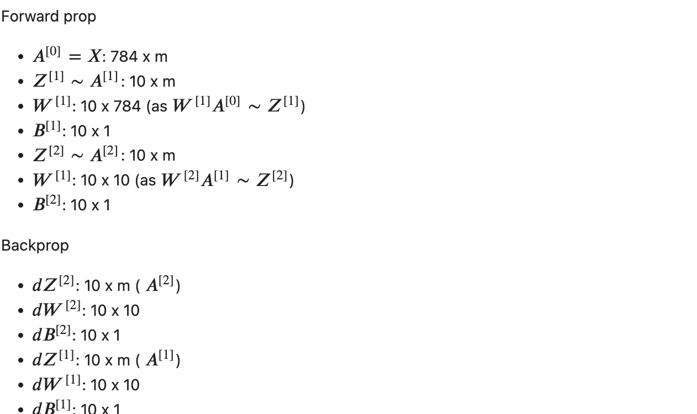

# Handwritten-Digit-Recognition
Built a handwritten digit recognition system using machine learning and image processing using NumPy only.

## Forward Propogation:

## Backword Propogation:

## Parameters:

## Variables and Notations:

## Performance :
Accuracy : 85%

## Testing :
Accuracy : 85%

Still good for a neural network without Tf/keras

